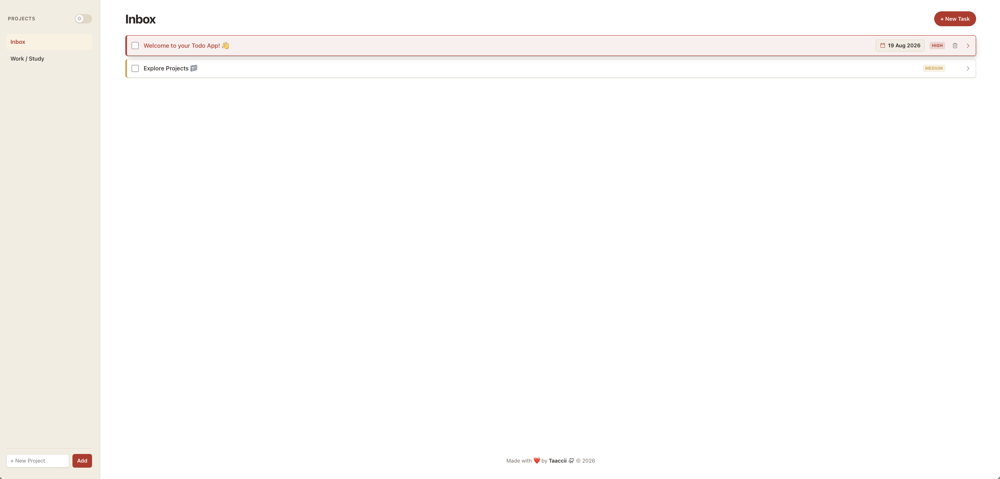
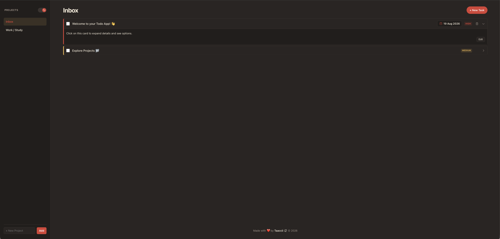

# Todo List

> A modular, responsive Todo List web application built with vanilla JavaScript, Webpack, and clean OOP design principles.

---

## 🔗 Live Demo

**Live Demo:** [taaccii.github.io/todo-list](https://taaccii.github.io/todo-list/)

---

## ✨ Features

- **Project & Task Management** — create, edit, and delete projects and tasks with custom priorities, descriptions, and due dates
- **Factory functions and closures** — data models (`Todo`, `Project`) encapsulate internal state and expose clean interface methods
- **LocalStorage Persistence** — automatic saving and loading of projects, active selections, and task completion states with seed data fallback
- **Dark & Light Theme** — smooth CSS theme toggle with instant head-script execution to prevent Flash of Unstyled Content (FOUC)
- **Native Dialog Modals** — form handling for creating projects and editing tasks powered by HTML5 `<dialog>` elements
- **Mobile-First Responsive Layout** — smooth drawer-style view switching between project navigation and task list on mobile
- **Zero `innerHTML` Usage** — dynamic UI constructed entirely through native DOM creation methods (`createElement`, `append`, `textContent`) for maximum security and performance
- **Date Formatting** — clean date parsing and display powered by `date-fns`

---

## 🛠️ Tech Stack

| Component | Technology |
|-----------|------------|
| **Markup** | HTML5 |
| **Style** | CSS3 (Variables & Custom Design System) |
| **CSS Reset** | Josh W. Comeau’s Custom CSS Reset |
| **Shadows** | Josh W. Comeau’s Shadow Palette |
| **Logic** | JavaScript (ES6+) |
| **Bundler** | Webpack |
| **Icons** | Phosphor Icons |
| **Date Utility** | `date-fns` |
| **Layout** | Flexbox + CSS Grid |

---

## 🏗️ Architecture

| Module | Pattern | Responsibility |
|--------|---------|----------------|
| `createTodo` | Factory | Encapsulates single task state, priority, completion, and update logic |
| `createProject` | Factory | Manages task collection, task removal, and serialization for a project |
| `projectManager` | Singleton | Controls global project list state and active project selection |
| `storageManager` | Singleton | Handles `localStorage` save/load/clear operations and default seed data |
| `domController` | Singleton | Handles layout construction, event delegation, theme toggles, and view rendering |
| `todoFormModal` / `projectFormModal` | Factory | Controls HTML5 `<dialog>` UI elements and form lifecycle for task/project creation |

---

## 💡 What I Learned

- Structuring multi-file applications using ES6 modules, factory functions, and Webpack
- Applying SOLID principles, specifically the Single Responsibility Principle, across data models and UI controllers
- Separating data logic from presentation: core objects (`Todo`, `Project`) have no knowledge of the DOM
- Safely manipulating the DOM using native creation methods without relying on `innerHTML`
- Managing state synchronization and serialization between object graphs and `localStorage`
- Implementing native HTML5 `<dialog>` modals with programmatic modal lifecycle controls
- Creating dark/light theme systems with CSS variables and preventing FOUC via inline head scripts
- Handling responsive view toggles for single-page dashboard layouts on mobile devices

---

## 📝 Notes

This project allowed me to practice modular JavaScript architecture and build a complete application from scratch using Webpack. The main challenge was maintaining strict separation between business logic and DOM manipulation while keeping the UI responsive to data changes. By relying entirely on factory functions, closures, and event delegation, the codebase remains modular, predictable, and easy to maintain. Particular attention was paid to the mobile UX, ensuring smooth transitions, responsive touch targets, and a clean theme switcher.

---

## 🙏 Acknowledgments

- **[Josh W. Comeau](https://www.joshwcomeau.com/)** — Special thanks for his excellent Modern CSS Reset and custom Shadow Palette generator, which provided the structural baseline for styling and elevation in this application.

---

## 📄 License

This project is licensed under the **MIT License** — see [`LICENSE`](./LICENSE) for details.

---

## 👨‍💻 Author

**Taaccii**

- 📧 [taccidev@gmail.com](mailto:taccidev@gmail.com)
- 🐙 GitHub: [@Taaccii](https://github.com/Taaccii)
- 💼 LinkedIn: [alessandro-barletta-dev](https://linkedin.com/in/alessandro-barletta-dev)

---

> *Project built as part of [The Odin Project](https://www.theodinproject.com/lessons/node-path-javascript-todo-list) JavaScript curriculum.*